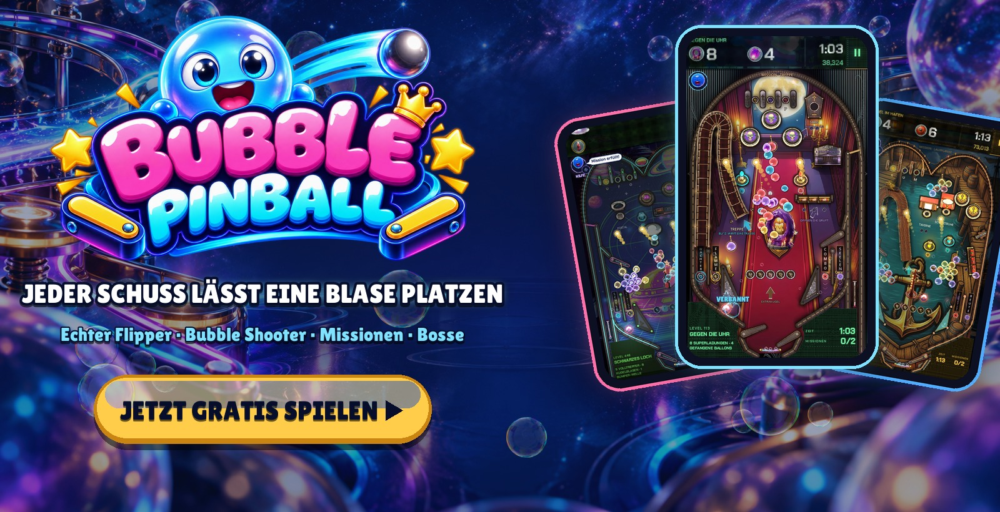
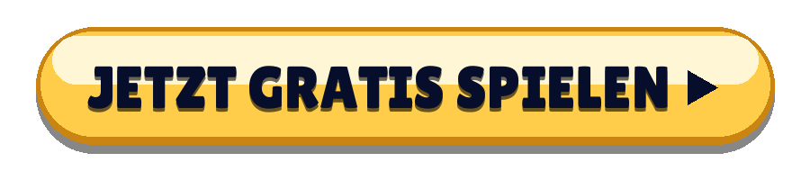
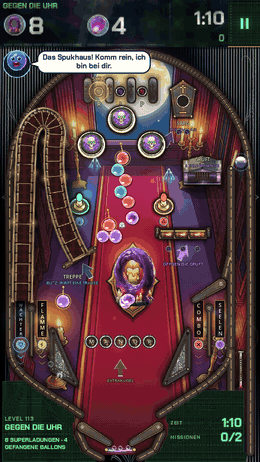
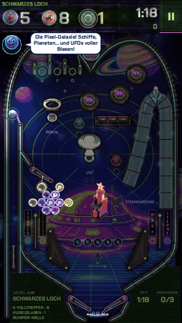
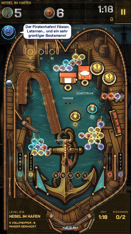
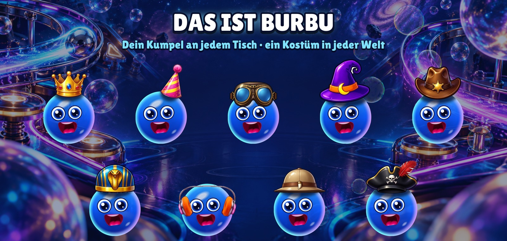
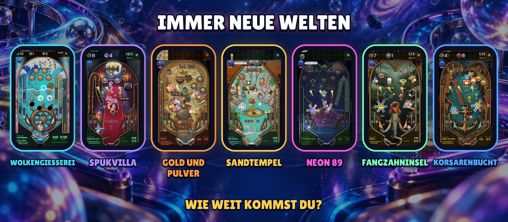

  

  <b>Ein echter Flipperautomat, bei dem jeder Schuss eine Blase platzen lässt.</b> 
  Kein Download · keine Anmeldung · Handy, Tablet und PC

  

  <a href="https://bubblepinball.com">bubblepinball.com</a> ·
  <a href="https://www.youtube.com/@BubblePinball">YouTube</a> ·
  <a href="assets/gameplay.mp4">Gameplay-Video</a> ·
  <a href="assets/">Pressekit</a>

[English](README.md) · [Español](README.es.md) · [Français](README.fr.md) · [Italiano](README.it.md) · [Português](README.pt-BR.md) · [Polski](README.pl.md) · [Русский](README.ru.md) · [Türkçe](README.tr.md) · [日本語](README.ja.md) · [한국어](README.ko.md) · [Bahasa Indonesia](README.id.md)

---

<table>
  <tr>
    <td align="center" width="33%"></td>
    <td align="center" width="33%"></td>
    <td align="center" width="33%"></td>
  </tr>
  <tr>
    <td align="center"><h3>Ganze Trauben platzen lassen</h3>Lade die Kugel mit einer Farbe auf und schieß die Blasen über dem Spielfeld ab. Triffst du den Anker einer Traube, stürzt sie komplett herunter.</td>
    <td align="center"><h3>Echter Flipper</h3>Flipper, Bumper, Schleudern, Rampen, Spinner, Löcher und Multiball, mit echter Physik. Schubs den Tisch an, wenn die Kugel frech wird.</td>
    <td align="center"><h3>Eine Mission an jedem Tisch</h3>Befreie gefangene Blasen, fang die Ballons, knack die Steine, schlag die Uhr. Kein Tisch spielt sich wie der andere.</td>
  </tr>
</table>

## Warum man nicht aufhören kann

- **Jeder Tisch ist eine neue Herausforderung.** Eigenes Layout, eigene Spielzeuge, eigene Missionen und eine Uhr, die jeden Schuss zur Entscheidung macht.
- **Bosse, die sich wehren.** Riesige Bosse bewachen die Zonen, mit Phasen, Angriffen und einem letzten Gefecht.
- **Immer etwas Neues.** Ganze Welten kommen hinzu, mit eigenen Maschinen, Musik, Bossen und Spielzeugen.
- **Hilfe, wenn du sie brauchst.** Burbu schaltet die passende Hilfe frei, wenn du feststeckst: die Nadel, die Regenbogenkugel, den Magneten oder Extrasekunden.
- **Für kurze Runden gemacht.** Ein Tisch dauert ein paar Minuten. Noch einer? Klar.

  

## Das ist Burbu™

**Burbu™** ist eine blaue Glasblase und dein Kumpel in Bubble Pinball™. Burbu feuert dich an, gibt dir Tipps, wenn ein Tisch knifflig wird, feiert jeden Sieg mit dir und bekommt in jeder Welt ein neues Kostüm. Je mehr ihr zusammen spielt, desto bessere Freunde werdet ihr.

  

## Immer neue welten

| Welt | Zonen |
|---|---|
| **WOLKENGIESSEREI** | WOLKENWERKSTATT · SCHAUMMEER · KRISTALLGEWÄCHSHAUS · STURMGIESSEREI · STERNENKRONE |
| **SPUKVILLA** | Die Halle · Die Bibliothek · Der Ballsaal · Der Uhrturm · Der Friedhof |
| **GOLD UND PULVER** | Der Saloon · Die Mine · Der Goldzug · Die Bank · Die Schlucht |
| **SANDTEMPEL** | Die Sphinx · Das Grab des Pharaos · Der Nil · Die Schatzkammer · Der Tempel des Ra |
| **NEON 89** | Die Spielhalle · Nachtfahrt · Pixelgalaxie · Die Tanzfläche · Cyberstadt |
| **FANGZAHNINSEL** | Die Wilde Küste · Reißzahn-Dschungel · Der Teersumpf · Der Vulkan · Das Nest des Königs |
| **KORSARENBUCHT** | Der Piratenhafen · Die Galeone · Die Schatzinsel · Das Versunkene Riff · Das Auge des Sturms |
| **…und mehr** | Es kommen immer neue Welten. |

   
  Android und iOS kommen bald

---

Bubble Pinball™ und Burbu™ sind Marken von MAVA Games. © 2026 MAVA Games. Alle Rechte vorbehalten. The names, logos, characters, images, videos and all other content in this repository are the property of MAVA Games; no licence is granted to copy, modify, distribute or use any of it. This repository holds public information about the game and does not contain its source code.
