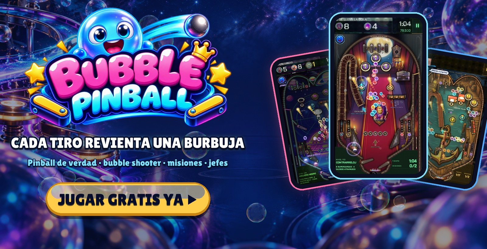
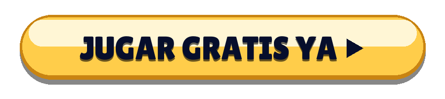
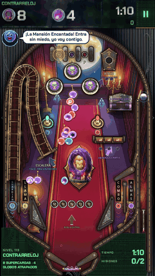
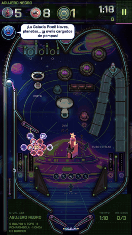
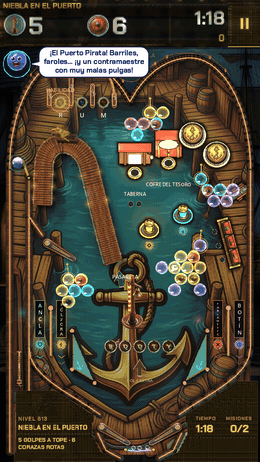
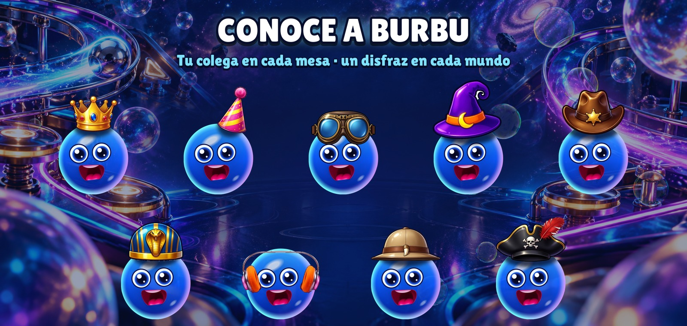
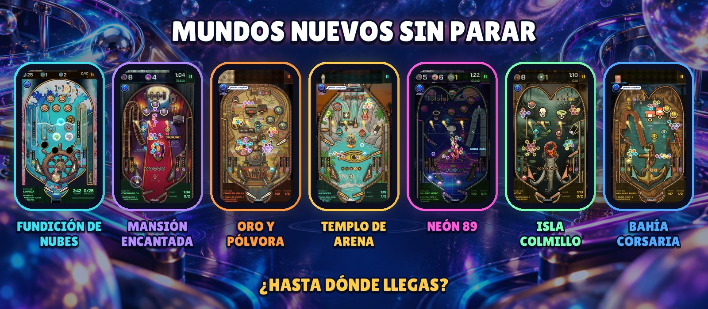

  

  <b>Una máquina de pinball de verdad donde cada tiro revienta una burbuja.</b> 
  Sin descargas · sin registro · móvil, tablet y PC

  

  <a href="https://bubblepinball.com">bubblepinball.com</a> ·
  <a href="https://www.youtube.com/@BubblePinball">YouTube</a> ·
  <a href="assets/gameplay.mp4">Vídeo de juego</a> ·
  <a href="assets/">Material de prensa</a>

[English](README.md) · [Deutsch](README.de.md) · [Français](README.fr.md) · [Italiano](README.it.md) · [Português](README.pt-BR.md) · [Polski](README.pl.md) · [Русский](README.ru.md) · [Türkçe](README.tr.md) · [日本語](README.ja.md) · [한국어](README.ko.md) · [Bahasa Indonesia](README.id.md)

---

<table>
  <tr>
    <td align="center" width="33%"></td>
    <td align="center" width="33%"></td>
    <td align="center" width="33%"></td>
  </tr>
  <tr>
    <td align="center"><h3>Revienta racimos enteros</h3>Carga la bola de un color y revienta las pompas que cuelgan sobre la mesa. Dale al ancla de un racimo y cae entero.</td>
    <td align="center"><h3>Pinball de verdad</h3>Flippers, bumpers, tirachinas, rampas, spinners, bocas y multibola, con física real. Sacude la mesa cuando la bola se pone chula.</td>
    <td align="center"><h3>Una misión en cada mesa</h3>Libera las pompas atrapadas, atrapa los globos, rompe las piedras, gánale al reloj. No hay dos mesas iguales.</td>
  </tr>
</table>

## Por qué no puedes parar

- **Cada mesa es un reto nuevo.** Su propio diseño, sus juguetes, sus misiones y un reloj que convierte cada tiro en una decisión.
- **Jefes que se defienden.** Jefes gigantes guardan las zonas, con fases, ataques y un último asalto.
- **Siempre hay algo nuevo.** Llegan mundos enteros con sus máquinas, su música, sus jefes y sus juguetes.
- **Ayuda cuando la necesitas.** Burbu te enciende la ayuda justa cuando te atascas: el alfiler, la bola arcoíris, el imán o segundos extra.
- **Hecho para partidas rápidas.** Una mesa dura un par de minutos. ¿Otra? Venga.

  

## Conoce a Burbu™

**Burbu™** es una pompa de cristal azul y tu colega en Bubble Pinball™. Te anima, te da pistas cuando una mesa se pone dura, celebra cada victoria contigo y estrena disfraz en cada mundo. Cuanto más jugáis juntos, más amigos sois.

  

## Mundos nuevos sin parar

| Mundo | Zonas |
|---|---|
| **FUNDICIÓN DE NUBES** | TALLER DE NUBES · MAR DE ESPUMA · INVERNADERO DE CRISTAL · FUNDICIÓN TORMENTA · CORONA ESTELAR |
| **MANSIÓN ENCANTADA** | El Vestíbulo · La Biblioteca · El Salón de Baile · La Torre del Reloj · El Cementerio |
| **ORO Y PÓLVORA** | El Saloon · La Mina · El Tren del Oro · El Banco · El Cañón |
| **TEMPLO DE ARENA** | La Esfinge · La Tumba del Faraón · El Nilo · La Cámara del Tesoro · El Templo de Ra |
| **NEÓN 89** | El Salón Arcade · Autopista Nocturna · Galaxia Píxel · La Pista de Baile · Ciudad Cyber |
| **ISLA COLMILLO** | La Costa Salvaje · La Selva Colmillo · El Pantano de Brea · El Volcán · El Nido del Rey |
| **BAHÍA CORSARIA** | El Puerto Pirata · El Galeón · La Isla del Tesoro · El Arrecife Hundido · El Ojo de la Tormenta |
| **…y más** | Siguen llegando mundos nuevos. |

   
  Android e iOS, muy pronto

---

Bubble Pinball™ y Burbu™ son marcas de MAVA Games. © 2026 MAVA Games. Todos los derechos reservados. The names, logos, characters, images, videos and all other content in this repository are the property of MAVA Games; no licence is granted to copy, modify, distribute or use any of it. This repository holds public information about the game and does not contain its source code.
