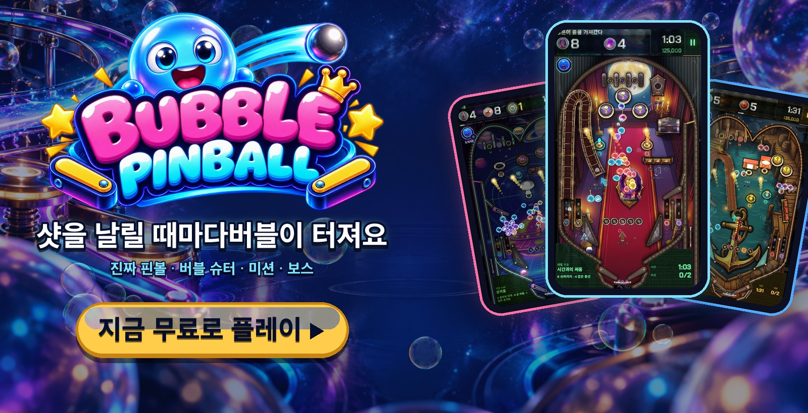
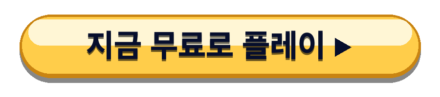
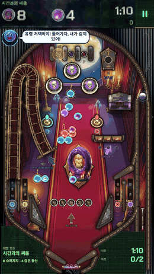
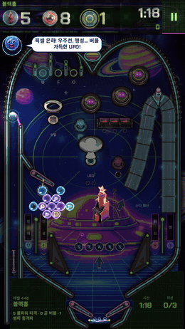
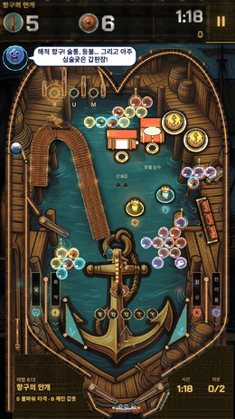
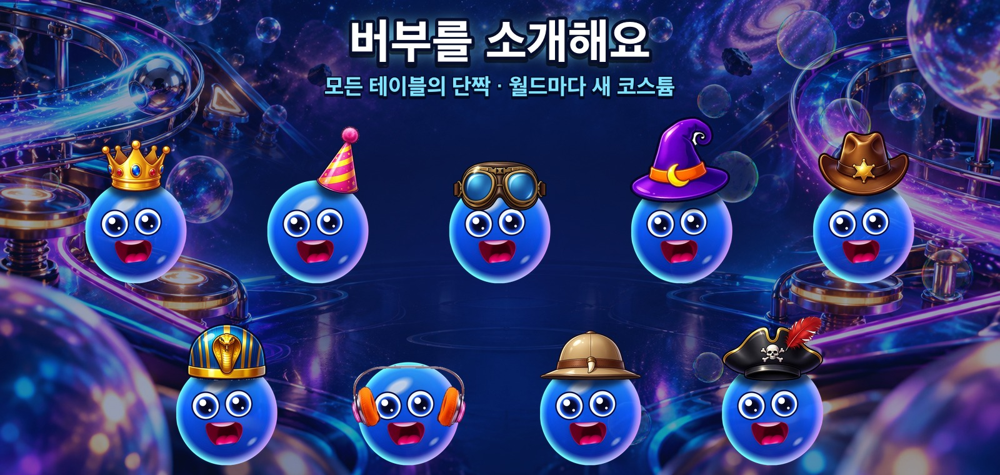
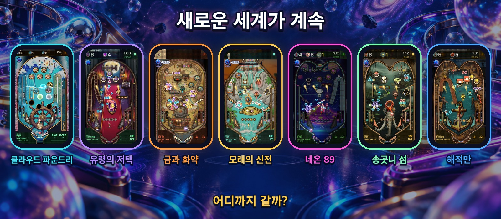

  

  <b>샷마다 버블이 터지는 진짜 핀볼 머신.</b> 
  설치 없음 · 가입 없음 · 폰, 태블릿, PC

  

  <a href="https://bubblepinball.com">bubblepinball.com</a> ·
  <a href="https://www.youtube.com/@BubblePinball">YouTube</a> ·
  <a href="assets/gameplay.mp4">게임 플레이 영상</a> ·
  <a href="assets/">보도 자료</a>

[English](README.md) · [Español](README.es.md) · [Deutsch](README.de.md) · [Français](README.fr.md) · [Italiano](README.it.md) · [Português](README.pt-BR.md) · [Polski](README.pl.md) · [Русский](README.ru.md) · [Türkçe](README.tr.md) · [日本語](README.ja.md) · [Bahasa Indonesia](README.id.md)

---

<table>
  <tr>
    <td align="center" width="33%"></td>
    <td align="center" width="33%"></td>
    <td align="center" width="33%"></td>
  </tr>
  <tr>
    <td align="center"><h3>송이째 터뜨리기</h3>공에 색을 충전하고 필드 위에 매달린 버블을 터뜨리세요. 송이의 고리를 맞히면 통째로 떨어져요.</td>
    <td align="center"><h3>진짜 핀볼</h3>플리퍼, 범퍼, 슬링샷, 램프, 스피너, 홀, 멀티볼까지 진짜 물리로. 공이 말을 안 들으면 테이블을 흔드세요.</td>
    <td align="center"><h3>테이블마다 미션</h3>갇힌 버블을 구하고, 풍선을 잡고, 돌을 깨고, 시간을 이기세요. 똑같은 테이블은 하나도 없어요.</td>
  </tr>
</table>

## 멈출 수 없는 이유

- **모든 테이블이 새로운 도전.** 고유한 배치, 장난감, 미션, 그리고 한 방 한 방을 선택으로 만드는 타이머.
- **반격하는 보스.** 거대한 보스가 구역을 지켜요. 페이즈, 공격, 그리고 최후의 저항.
- **언제나 새로운 것.** 고유한 기계, 음악, 보스, 장난감을 가진 월드가 통째로 찾아와요.
- **필요할 때 도움.** 막히면 버부가 딱 맞는 도움을 밝혀 줘요: 핀, 무지개 공, 자석, 추가 시간.
- **짧게 즐기기 좋게.** 한 테이블에 몇 분. 한 판 더? 물론이죠.

  

## 버부(Burbu™)를 소개해요

**Burbu™(버부)** 는 파란 유리 버블이자 Bubble Pinball™ 의 단짝이에요. 응원해 주고, 테이블이 어려워지면 힌트를 주고, 이길 때마다 함께 기뻐하고, 월드마다 새 코스튬을 입어요. 함께 놀수록 더 친해져요.

  

## 새로운 세계가 계속

| 월드 | 구역 |
|---|---|
| **클라우드 파운드리** | 구름 공방 · 거품 바다 · 수정 온실 · 폭풍 주조소 · 별의 왕관 |
| **유령의 저택** | 현관 홀 · 서재 · 무도회장 · 시계탑 · 묘지 |
| **금과 화약** | 살롱 · 광산 · 황금 열차 · 은행 · 협곡 |
| **모래의 신전** | 스핑크스 · 파라오의 무덤 · 나일강 · 보물의 방 · 라의 신전 |
| **네온 89** | 오락실 · 나이트 드라이브 · 픽셀 은하 · 댄스 플로어 · 사이버 시티 |
| **송곳니 섬** | 야생 해안 · 송곳니 정글 · 타르 늪 · 화산 · 왕의 둥지 |
| **해적만** | 해적 항구 · 갤리온선 · 보물섬 · 가라앉은 산호초 · 폭풍의 눈 |
| **…그리고 더** | 새 월드가 계속 찾아와요. |

   
  Android·iOS 곧 출시

---

Bubble Pinball™ 및 Burbu™는 MAVA Games의 상표입니다. © 2026 MAVA Games. All rights reserved. The names, logos, characters, images, videos and all other content in this repository are the property of MAVA Games; no licence is granted to copy, modify, distribute or use any of it. This repository holds public information about the game and does not contain its source code.
