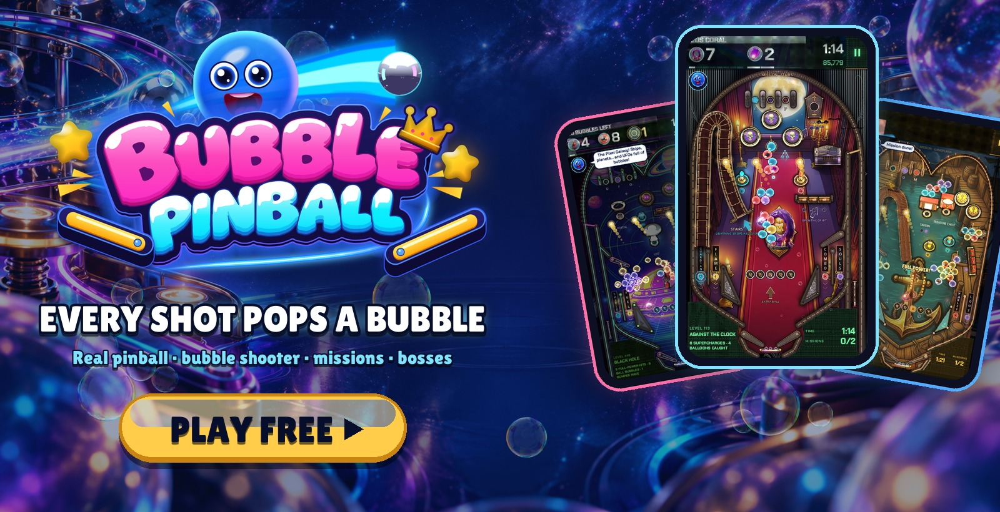
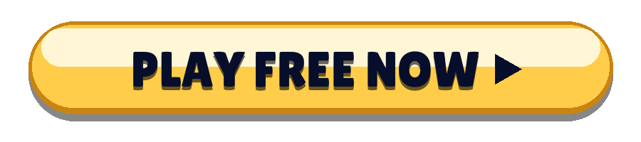
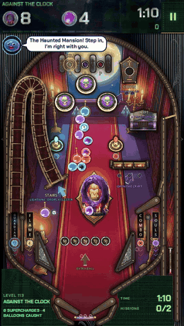
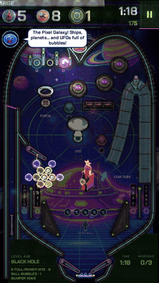
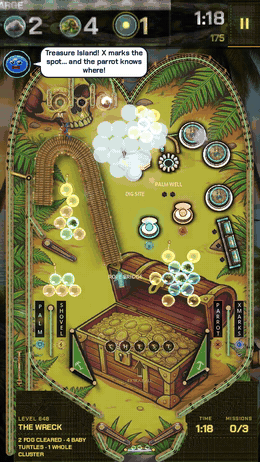
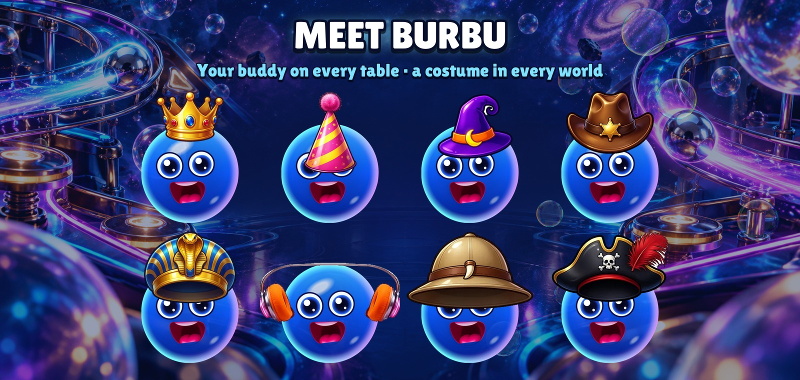
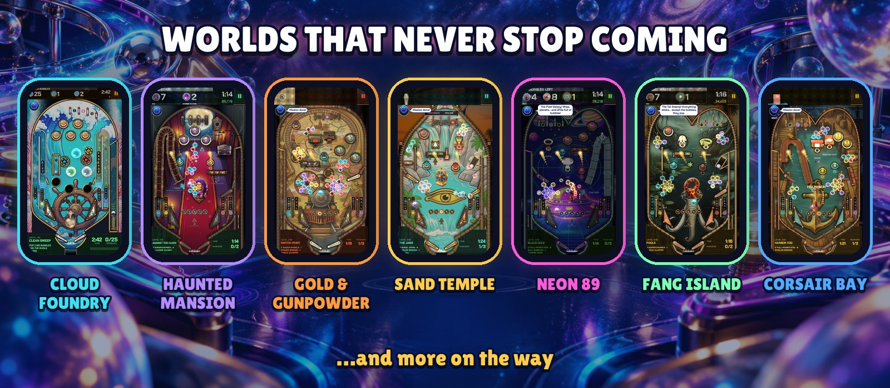

  

  <b>A real pinball machine where every shot pops a bubble.</b> 
  Free in your browser · no download · no sign-up · phone, tablet and computer

  

  <a href="https://bubblepinball.com">bubblepinball.com</a> ·
  <a href="https://www.youtube.com/@BubblePinball">YouTube</a> ·
  <a href="assets/gameplay.mp4">Gameplay video</a> ·
  <a href="assets/">Press kit</a> ·
  <a href="#español">Español</a>

---

<table>
  <tr>
    <td align="center" width="33%"></td>
    <td align="center" width="33%"></td>
    <td align="center" width="33%"></td>
  </tr>
  <tr>
    <td align="center"><h3>Pop whole clusters</h3>Charge the ball with a colour and blast the bubbles hanging over the playfield. Hit a cluster's anchor and the whole bunch comes crashing down.</td>
    <td align="center"><h3>Real pinball, for real</h3>Flippers, bumpers, slingshots, ramps, spinners, scoops and multiball, with real physics. Nudge the table when the ball gets cheeky.</td>
    <td align="center"><h3>A mission on every table</h3>Free the trapped bubbles, catch the balloons, crack the stones, beat the clock. No two tables play the same.</td>
  </tr>
</table>

## Why players can't stop

- **Every table is a new challenge.** Its own layout, its own toys, its own missions, and a clock that turns every shot into a decision.
- **Bosses that fight back.** Giant bosses guard every zone, with phases, attacks and a last stand.
- **Always something new.** Whole worlds arrive with their own machines, music, bosses and toys.
- **Help when you need it.** Burbu lights up the right help when you are stuck: the pin, the rainbow ball, the magnet or extra seconds.
- **Made for quick sessions.** A table takes a couple of minutes. One more? Sure.

  

## Meet Burbu™

**Burbu™** is a blue glass bubble and your buddy in Bubble Pinball™. Burbu cheers you on, gives you a tip when a table gets tough, celebrates every win with you and gets a new costume in every world: a crown, a witch hat, a cowboy hat, a pharaoh's crown, walkman headphones, an explorer's helmet, a pirate tricorn… The more you play together, the better friends you become.

  

## Worlds that never stop coming

| World | Zones |
|---|---|
| **Cloud Foundry** | Cloud Workshop · Foam Sea · Crystal Greenhouse · Storm Foundry · Stellar Crown |
| **Haunted Mansion** | The Hall · The Library · The Ballroom · The Clock Tower · The Graveyard |
| **Gold & Gunpowder** | The Saloon · The Mine · The Gold Train · The Bank · The Canyon |
| **Sand Temple** | The Sphinx · The Pharaoh's Tomb · The Nile · The Treasure Chamber · The Temple of Ra |
| **Neon 89** | The Arcade Hall · Night Drive · Pixel Galaxy · The Dance Floor · Cyber City |
| **Fang Island** | The Wild Coast · Fang Jungle · The Tar Swamp · The Volcano · The King's Nest |
| **Corsair Bay** | Pirate Harbor · The Galleon · Treasure Island · The Sunken Reef · The Eye of the Storm |
| **…and more** | New worlds keep arriving. How far can you go? |

   
  Android and iOS coming soon

---

## Español

**Bubble Pinball™ es una máquina de pinball de verdad en la que cada tiro revienta una pompa.** Flippers, bumpers, rampas y física reales, con un bubble shooter dentro: carga la bola de un color, apunta y revienta los racimos antes de que se acabe el reloj. Cada mesa trae sus propias misiones, cada zona un jefe gigante, y los mundos no paran de llegar: la Fundición de Nubes, la Mansión Encantada, Oro y Pólvora, el Templo de Arena, Neón 89, la Isla Colmillo, la Bahía Corsaria… ¿Hasta dónde llegas?

**Burbu™** es una pompa de cristal azul y tu colega en el juego: te anima, te da pistas cuando una mesa se pone dura, te enciende la ayuda justa cuando te atascas y celebra cada victoria contigo. Cada mundo trae un disfraz nuevo para Burbu.

**[Juega gratis en bubblepinball.com/play](https://bubblepinball.com/play/)**: sin descargas, sin registro, en el móvil, la tableta o el ordenador.

---

Bubble Pinball™ and Burbu™ are trademarks of MAVA Games. © 2026 MAVA Games. All rights reserved. The names, logos, characters, images, videos and all other content in this repository are the property of MAVA Games; no licence is granted to copy, modify, distribute or use any of it. This repository holds public information about the game and does not contain its source code.
