

  <a href="https://bubblepinball.com">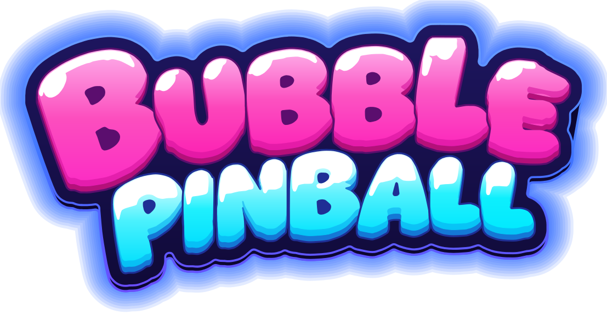</a>

<h3 align="center">A real pinball machine where every shot pops a bubble.</h3>

  <a href="https://bubblepinball.com/play/"><b>▶ Play free in your browser</b></a> ·
  <a href="https://bubblepinball.com">bubblepinball.com</a> ·
  <a href="https://www.youtube.com/@BubblePinball">YouTube</a> ·
  <a href="#español">Español</a>

  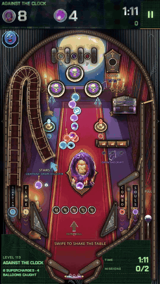 
  <a href="assets/gameplay.mp4">Watch the gameplay video</a>

## What is Bubble Pinball™?

**Bubble Pinball™** mixes two classics: a pinball machine with real flippers, bumpers, ramps and physics, and a bubble shooter. Every table hangs clusters of coloured bubbles over the playfield. Charge the ball with a colour, aim your shots and pop the bubbles before the clock runs out. Knock out a cluster's anchor and the whole bunch comes down.

- **Missions on every table.** Each table asks for something different: free the trapped bubbles, catch the balloons, break the stones, beat the boss.
- **A saga of worlds.** Levels come in worlds of their own, each with its machines, music, bosses and toys, and new worlds keep arriving.
- **Play anywhere.** Free on the web, no download and no sign-up, on phones, tablets and computers.

## Meet Burbu™

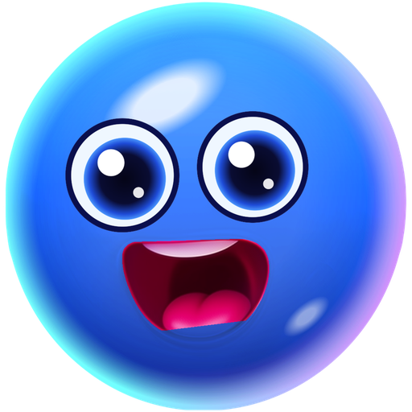

**Burbu™** is a blue glass bubble and your buddy in Bubble Pinball™. Burbu cheers you on, gives you a hint when a table gets tough, lights up the right help when you are stuck and celebrates every win with you. The more you play together, the better friends you become.

Every world has a costume for Burbu to win:

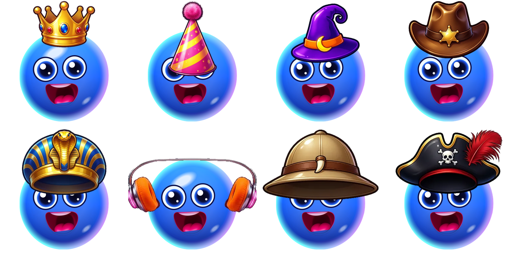

## The worlds

<table>
  <tr>
    <td align="center" width="25%">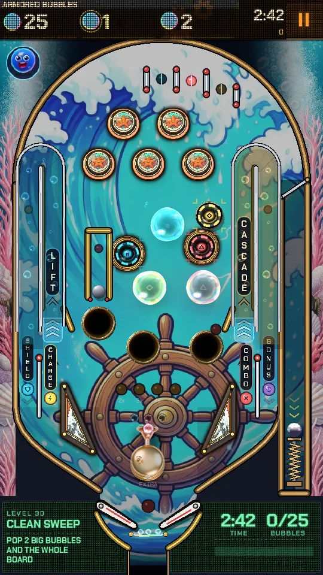 <b>Cloud Foundry</b> Where bubbles are born: the Cloud Workshop, the Foam Sea, the Crystal Greenhouse, the Storm Foundry and the Stellar Crown.</td>
    <td align="center" width="25%">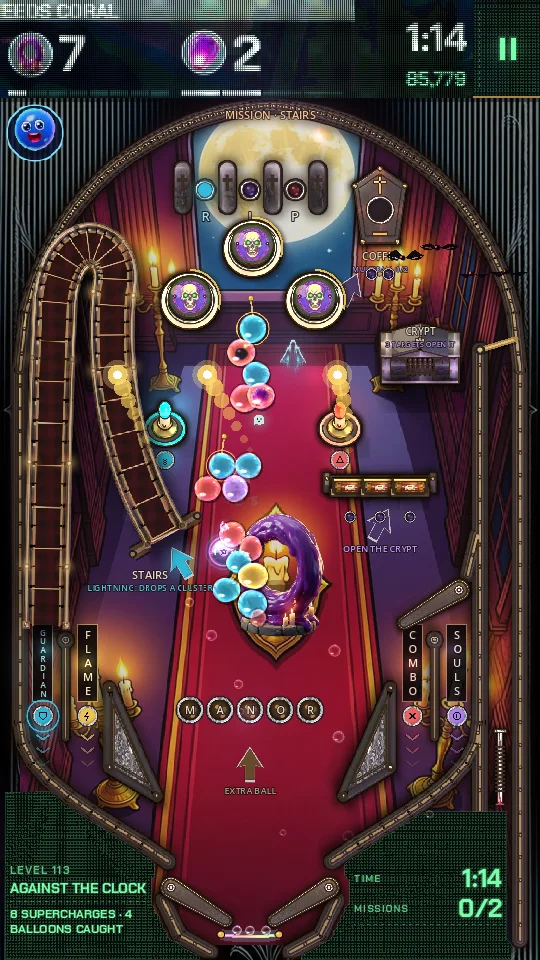 <b>Haunted Mansion</b> The Hall, the Library, the Ballroom, the Clock Tower and the Graveyard. Spirits steal the ball.</td>
    <td align="center" width="25%">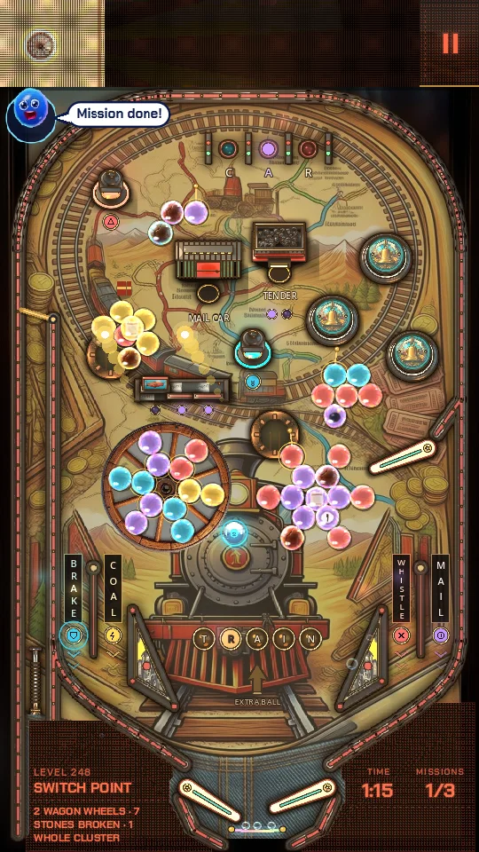 <b>Gold &amp; Gunpowder</b> The Saloon, the Mine, the Gold Train, the Bank and the Canyon. Duels at high noon.</td>
    <td align="center" width="25%">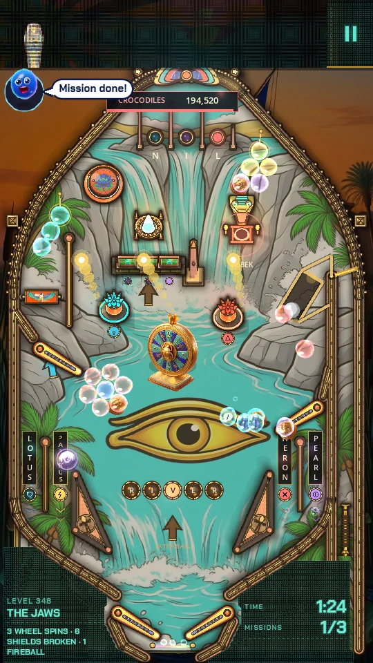 <b>Sand Temple</b> The Sphinx, the Pharaoh's Tomb, the Nile, the Treasure Chamber and the Temple of Ra.</td>
  </tr>
  <tr>
    <td align="center">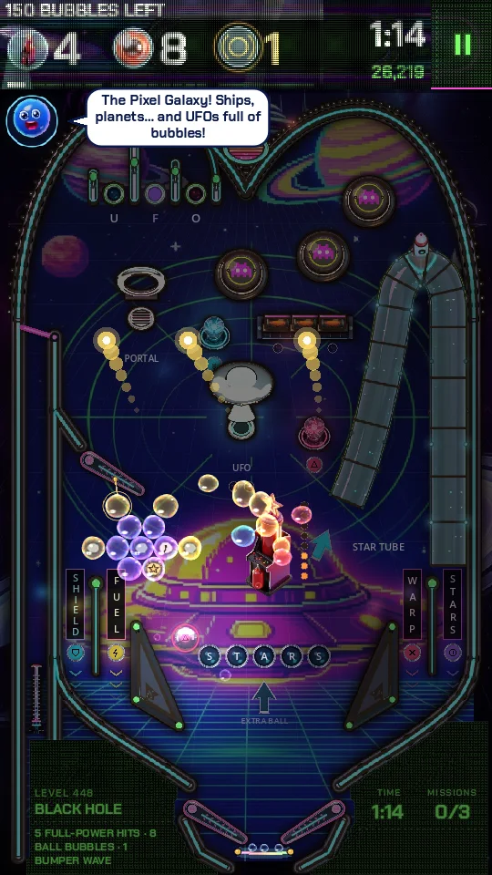 <b>Neon 89</b> The Arcade Hall, Night Drive, Pixel Galaxy, the Dance Floor and Cyber City.</td>
    <td align="center">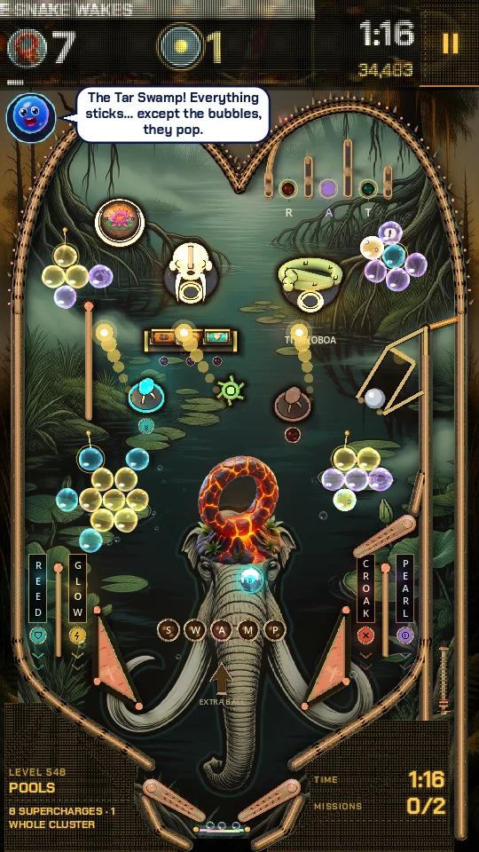 <b>Fang Island</b> The Wild Coast, Fang Jungle, the Tar Swamp, the Volcano and the King's Nest.</td>
    <td align="center">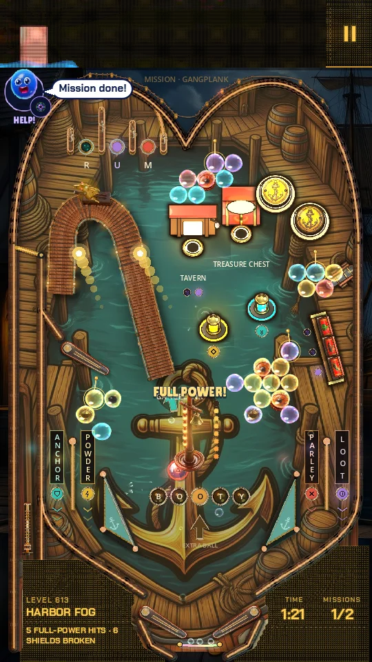 <b>Corsair Bay</b> Pirate Harbor, the Galleon, Treasure Island, the Sunken Reef and the Eye of the Storm.</td>
    <td align="center"> <b>…and more on the way</b> New worlds keep arriving. How far can you go?</td>
  </tr>
</table>

## Play

- **Web:** [bubblepinball.com/play](https://bubblepinball.com/play/), free.
- **Videos:** [youtube.com/@BubblePinball](https://www.youtube.com/@BubblePinball)
- **Android and iOS:** coming soon.

---

## Español

**Bubble Pinball™** es una máquina de pinball de verdad (flippers, bumpers, rampas y física reales) con un bubble shooter dentro: carga la bola de un color, apunta y revienta las pompas de cada mesa antes de que se acabe el reloj. Cada mesa trae sus propias misiones y los mundos no paran de llegar: la Fundición de Nubes, la Mansión Encantada, Oro y Pólvora, el Templo de Arena, Neón 89, la Isla Colmillo, la Bahía Corsaria… ¿Hasta dónde llegas?

**Burbu™** es una pompa de cristal azul y tu colega en el juego: te anima, te da pistas cuando una mesa se pone dura, te enciende la ayuda justa cuando te atascas y celebra cada victoria contigo. Cada mundo trae un disfraz para Burbu.

Juega gratis en [bubblepinball.com/play](https://bubblepinball.com/play/).

---

## Legal

Bubble Pinball™ and Burbu™ are trademarks of MAVA Games.

© 2026 MAVA Games. All rights reserved. The names, logos, characters, images, videos and all other content in this repository are the property of MAVA Games. No licence is granted to copy, modify, distribute or use any of it. This repository holds public information about the game; it does not contain the game's source code.
