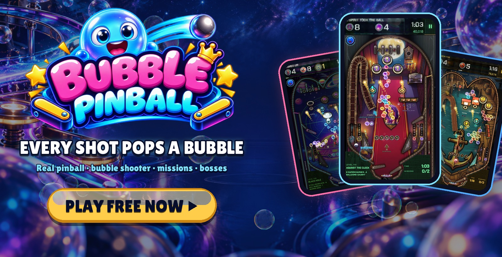
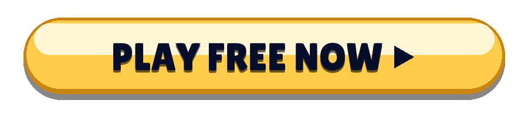
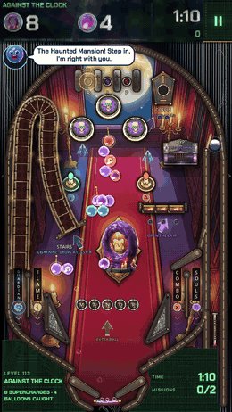
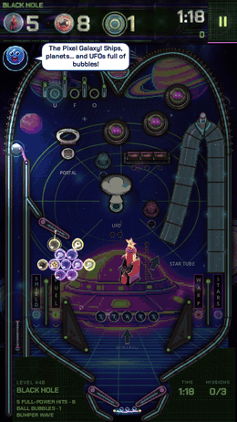
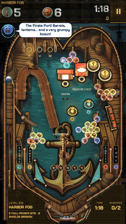
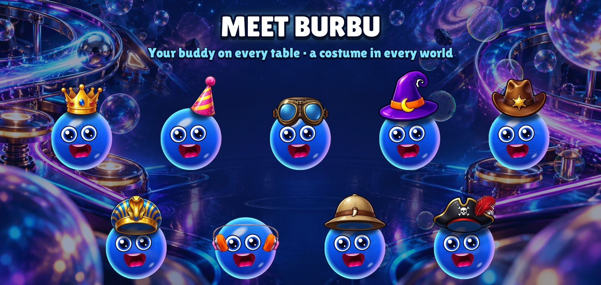
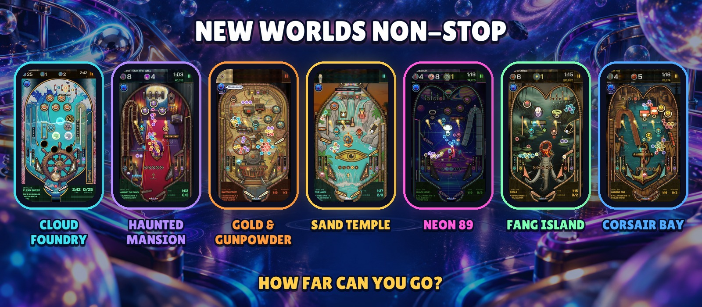

  

  <b>A real pinball machine where every shot pops a bubble.</b> 
  No download · no sign-up · phone, tablet and PC

  

  <a href="https://bubblepinball.com">bubblepinball.com</a> ·
  <a href="https://www.youtube.com/@BubblePinball">YouTube</a> ·
  <a href="assets/gameplay.mp4">Gameplay video</a> ·
  <a href="assets/">Press kit</a>

[Español](README.es.md) · [Deutsch](README.de.md) · [Français](README.fr.md) · [Italiano](README.it.md) · [Português](README.pt-BR.md) · [Polski](README.pl.md) · [Русский](README.ru.md) · [Türkçe](README.tr.md) · [日本語](README.ja.md) · [한국어](README.ko.md) · [Bahasa Indonesia](README.id.md)

---

<table>
  <tr>
    <td align="center" width="33%"></td>
    <td align="center" width="33%"></td>
    <td align="center" width="33%"></td>
  </tr>
  <tr>
    <td align="center"><h3>Pop whole clusters</h3>Charge the ball with a colour and blast the bubbles hanging over the playfield. Hit a cluster's anchor and the whole bunch comes crashing down.</td>
    <td align="center"><h3>Real pinball, for real</h3>Flippers, bumpers, slingshots, ramps, spinners, scoops and multiball, with real physics. Nudge the table when the ball gets cheeky.</td>
    <td align="center"><h3>A mission on every table</h3>Free the trapped bubbles, catch the balloons, crack the stones, beat the clock. No two tables play the same.</td>
  </tr>
</table>

## Why players can't stop

- **Every table is a new challenge.** Its own layout, its own toys, its own missions, and a clock that turns every shot into a decision.
- **Bosses that fight back.** Giant bosses guard the zones, with phases, attacks and a last stand.
- **Always something new.** Whole worlds arrive with their own machines, music, bosses and toys.
- **Help when you need it.** Burbu lights up the right help when you are stuck: the pin, the rainbow ball, the magnet or extra seconds.
- **Made for quick sessions.** A table takes a couple of minutes. One more? Sure.

  

## Meet Burbu™

**Burbu™** is a blue glass bubble and your buddy in Bubble Pinball™. Burbu cheers you on, gives you a tip when a table gets tough, celebrates every win with you and gets a new costume in every world. The more you play together, the better friends you become.

  

## New worlds non-stop

| World | Zones |
|---|---|
| **CLOUD FOUNDRY** | CLOUD WORKSHOP · FOAM SEA · CRYSTAL GREENHOUSE · STORM FOUNDRY · STELLAR CROWN |
| **HAUNTED MANSION** | The Hall · The Library · The Ballroom · The Clock Tower · The Graveyard |
| **GOLD & GUNPOWDER** | The Saloon · The Mine · The Gold Train · The Bank · The Canyon |
| **SAND TEMPLE** | The Sphinx · The Pharaoh's Tomb · The Nile · The Treasure Chamber · The Temple of Ra |
| **NEON 89** | The Arcade Hall · Night Drive · Pixel Galaxy · The Dance Floor · Cyber City |
| **FANG ISLAND** | The Wild Coast · Fang Jungle · The Tar Swamp · The Volcano · The King's Nest |
| **CORSAIR BAY** | Pirate Harbor · The Galleon · Treasure Island · The Sunken Reef · The Eye of the Storm |
| **…and more** | New worlds keep arriving. |

   
  Android and iOS coming soon

---

Bubble Pinball™ and Burbu™ are trademarks of MAVA Games. © 2026 MAVA Games. All rights reserved. The names, logos, characters, images, videos and all other content in this repository are the property of MAVA Games; no licence is granted to copy, modify, distribute or use any of it. This repository holds public information about the game and does not contain its source code.
