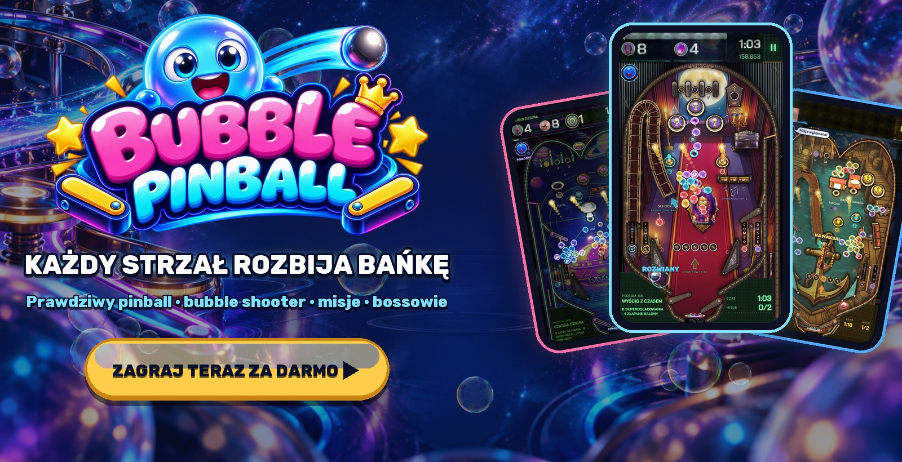
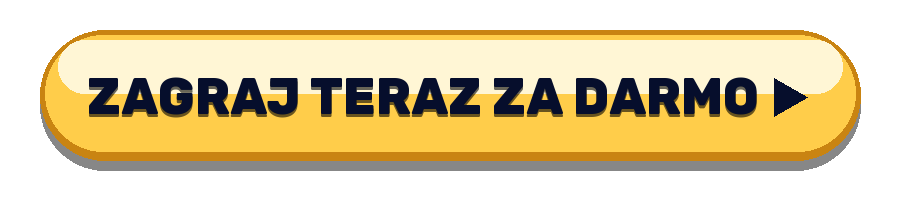
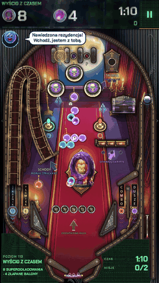
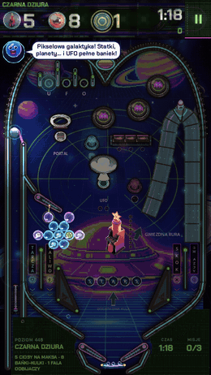
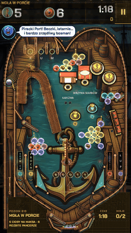
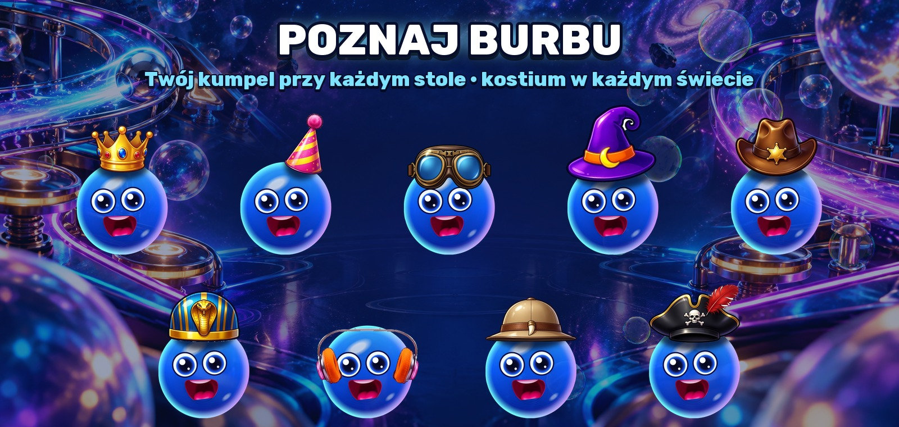
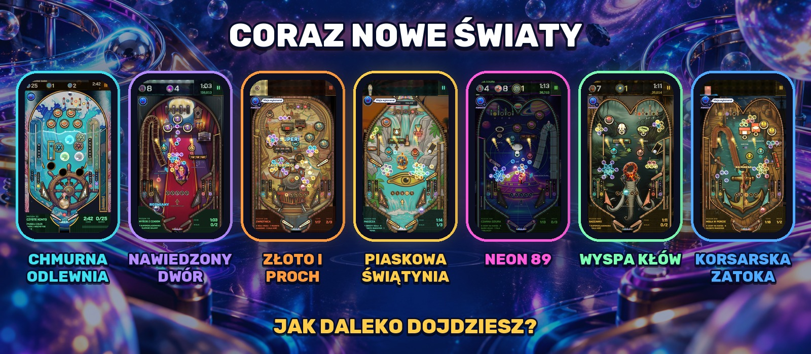

  

  <b>Prawdziwy pinball, w którym każdy strzał rozbija bańkę.</b> 
  Bez pobierania · bez rejestracji · telefon, tablet i PC

  

  <a href="https://bubblepinball.com">bubblepinball.com</a> ·
  <a href="https://www.youtube.com/@BubblePinball">YouTube</a> ·
  <a href="assets/gameplay.mp4">Film z rozgrywki</a> ·
  <a href="assets/">Materiały prasowe</a>

[English](README.md) · [Español](README.es.md) · [Deutsch](README.de.md) · [Français](README.fr.md) · [Italiano](README.it.md) · [Português](README.pt-BR.md) · [Русский](README.ru.md) · [Türkçe](README.tr.md) · [日本語](README.ja.md) · [한국어](README.ko.md) · [Bahasa Indonesia](README.id.md)

---

<table>
  <tr>
    <td align="center" width="33%"></td>
    <td align="center" width="33%"></td>
    <td align="center" width="33%"></td>
  </tr>
  <tr>
    <td align="center"><h3>Zbijaj całe grona</h3>Naładuj kulkę kolorem i rozbijaj bańki wiszące nad stołem. Traf w kotwicę grona, a spadnie całe.</td>
    <td align="center"><h3>Prawdziwy pinball</h3>Flippery, bumpery, procy, rampy, spinnery, otwory i multiball, z prawdziwą fizyką. Szturchnij stół, gdy kulka zaczyna się stawiać.</td>
    <td align="center"><h3>Misja przy każdym stole</h3>Uwolnij uwięzione bańki, złap balony, rozbij kamienie, pokonaj zegar. Żaden stół nie gra się tak samo.</td>
  </tr>
</table>

## Dlaczego nie da się przestać

- **Każdy stół to nowe wyzwanie.** Własny układ, własne zabawki, własne misje i zegar, który z każdego strzału robi decyzję.
- **Bossowie, którzy walczą.** Ogromni bossowie strzegą stref, mają fazy, ataki i ostatni bój.
- **Zawsze coś nowego.** Przybywają całe światy z własnymi maszynami, muzyką, bossami i zabawkami.
- **Pomoc, gdy jej potrzebujesz.** Burbu podsuwa właściwą pomoc, gdy utkniesz: szpilkę, tęczową kulkę, magnes albo dodatkowe sekundy.
- **Na krótkie partie.** Stół zajmuje kilka minut. Jeszcze jeden? Jasne.

  

## Poznaj Burbu™

**Burbu™** to niebieska szklana bańka i twój kumpel w Bubble Pinball™. Burbu kibicuje ci, podpowiada, gdy stół robi się trudny, świętuje z tobą każde zwycięstwo i w każdym świecie dostaje nowy kostium. Im więcej gracie razem, tym bardziej się przyjaźnicie.

  

## Coraz nowe światy

| Świat | Strefy |
|---|---|
| **CHMURNA ODLEWNIA** | CHMURNY WARSZTAT · MORZE PIANY · KRYSZTAŁOWA SZKLARNIA · BURZOWA ODLEWNIA · GWIEZDNA KORONA |
| **NAWIEDZONY DWÓR** | Hol · Biblioteka · Sala Balowa · Wieża Zegarowa · Cmentarz |
| **ZŁOTO I PROCH** | Saloon · Kopalnia · Złoty Pociąg · Bank · Kanion |
| **PIASKOWA ŚWIĄTYNIA** | Sfinks · Grobowiec Faraona · Nil · Skarbiec · Świątynia Ra |
| **NEON 89** | Salon Gier · Nocna Jazda · Pikselowa Galaktyka · Parkiet · Cybermiasto |
| **WYSPA KŁÓW** | Dzikie Wybrzeże · Dżungla Kła · Smoliste Bagno · Wulkan · Gniazdo Króla |
| **KORSARSKA ZATOKA** | Piracki Port · Galeon · Wyspa Skarbów · Zatopiona Rafa · Oko Burzy |
| **…i więcej** | Wciąż przybywają nowe światy. |

   
  Android i iOS już wkrótce

---

Bubble Pinball™ i Burbu™ są znakami towarowymi MAVA Games. © 2026 MAVA Games. Wszelkie prawa zastrzeżone. The names, logos, characters, images, videos and all other content in this repository are the property of MAVA Games; no licence is granted to copy, modify, distribute or use any of it. This repository holds public information about the game and does not contain its source code.
