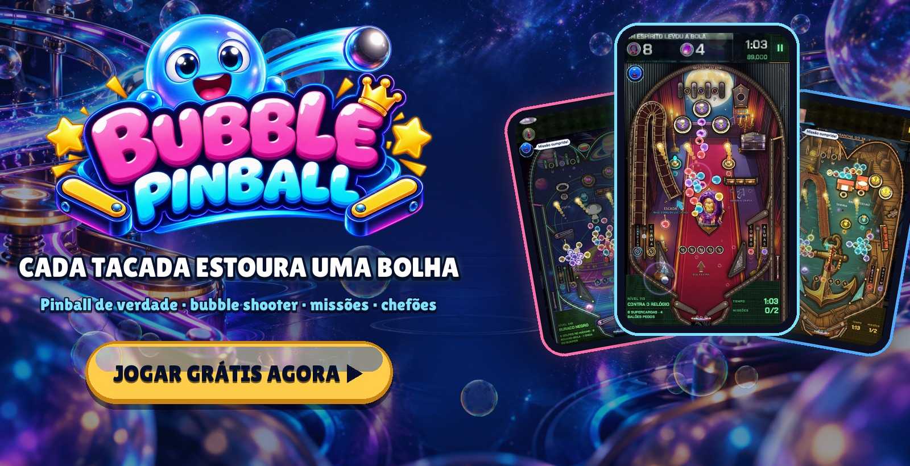
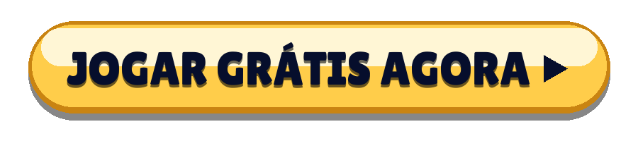
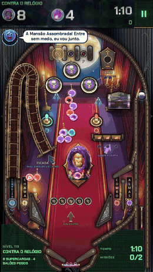
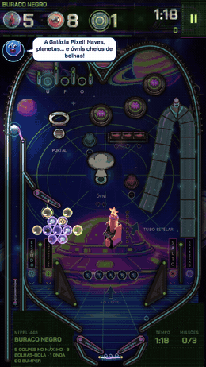
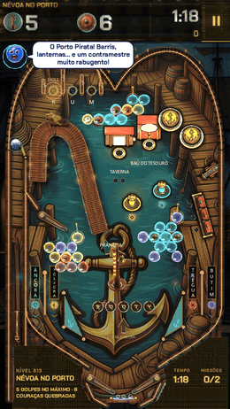
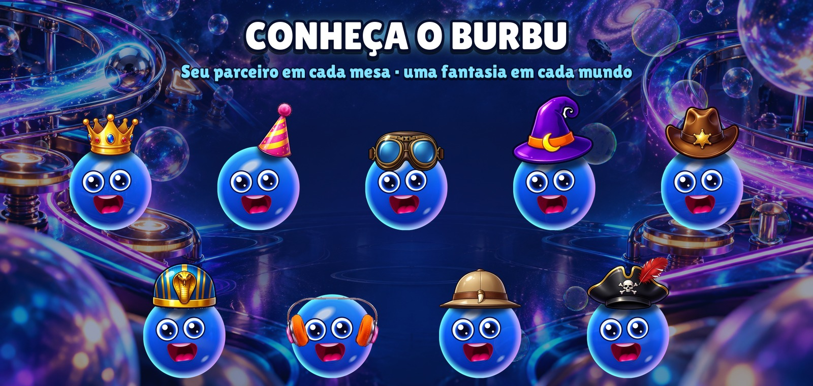
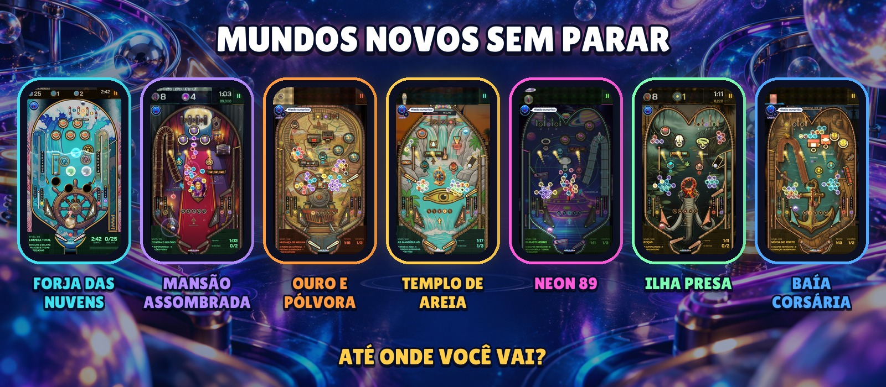

  

  <b>Um fliperama de verdade em que cada tacada estoura uma bolha.</b> 
  Sem download · sem cadastro · celular, tablet e PC

  

  <a href="https://bubblepinball.com">bubblepinball.com</a> ·
  <a href="https://www.youtube.com/@BubblePinball">YouTube</a> ·
  <a href="assets/gameplay.mp4">Vídeo do jogo</a> ·
  <a href="assets/">Kit de imprensa</a>

[English](README.md) · [Español](README.es.md) · [Deutsch](README.de.md) · [Français](README.fr.md) · [Italiano](README.it.md) · [Polski](README.pl.md) · [Русский](README.ru.md) · [Türkçe](README.tr.md) · [日本語](README.ja.md) · [한국어](README.ko.md) · [Bahasa Indonesia](README.id.md)

---

<table>
  <tr>
    <td align="center" width="33%"></td>
    <td align="center" width="33%"></td>
    <td align="center" width="33%"></td>
  </tr>
  <tr>
    <td align="center"><h3>Estoure cachos inteiros</h3>Carregue a bola com uma cor e estoure as bolhas penduradas sobre a mesa. Acerte a âncora de um cacho e ele cai inteiro.</td>
    <td align="center"><h3>Pinball de verdade</h3>Flippers, bumpers, estilingues, rampas, spinners, buracos e multibola, com física real. Sacuda a mesa quando a bola ficar abusada.</td>
    <td align="center"><h3>Uma missão em cada mesa</h3>Liberte as bolhas presas, pegue os balões, quebre as pedras, vença o relógio. Nenhuma mesa é igual.</td>
  </tr>
</table>

## Por que não dá para parar

- **Cada mesa é um novo desafio.** Seu próprio layout, seus brinquedos, suas missões e um relógio que transforma cada tiro numa decisão.
- **Chefões que revidam.** Chefões gigantes guardam as zonas, com fases, ataques e uma última batalha.
- **Sempre tem novidade.** Chegam mundos inteiros com suas máquinas, músicas, chefões e brinquedos.
- **Ajuda na hora certa.** O Burbu acende a ajuda certa quando você trava: o alfinete, a bola arco-íris, o ímã ou segundos extras.
- **Feito para partidas rápidas.** Uma mesa dura uns dois minutos. Mais uma? Claro.

  

## Conheça o Burbu™

**Burbu™** é uma bolha de vidro azul e seu parceiro em Bubble Pinball™. Ele te anima, dá dicas quando a mesa fica difícil, comemora cada vitória com você e ganha uma fantasia nova em cada mundo. Quanto mais vocês jogam juntos, mais amigos ficam.

  

## Mundos novos sem parar

| Mundo | Zonas |
|---|---|
| **FORJA DAS NUVENS** | OFICINA DAS NUVENS · MAR DE ESPUMA · ESTUFA DE CRISTAL · FORJA DOS TROVÕES · COROA ESTELAR |
| **MANSÃO ASSOMBRADA** | O Vestíbulo · A Biblioteca · O Salão de Baile · A Torre do Relógio · O Cemitério |
| **OURO E PÓLVORA** | O Saloon · A Mina · O Trem do Ouro · O Banco · O Cânion |
| **TEMPLO DE AREIA** | A Esfinge · A Tumba do Faraó · O Nilo · A Câmara do Tesouro · O Templo de Rá |
| **NEON 89** | O Fliperama · Estrada Noturna · Galáxia Pixel · A Pista de Dança · Cidade Cyber |
| **ILHA PRESA** | A Costa Selvagem · A Selva Presa · O Pântano de Piche · O Vulcão · O Ninho do Rei |
| **BAÍA CORSÁRIA** | O Porto Pirata · O Galeão · A Ilha do Tesouro · O Recife Afundado · O Olho da Tempestade |
| **…e mais** | Mundos novos não param de chegar. |

   
  Android e iOS em breve

---

Bubble Pinball™ e Burbu™ são marcas de MAVA Games. © 2026 MAVA Games. Todos os direitos reservados. The names, logos, characters, images, videos and all other content in this repository are the property of MAVA Games; no licence is granted to copy, modify, distribute or use any of it. This repository holds public information about the game and does not contain its source code.
