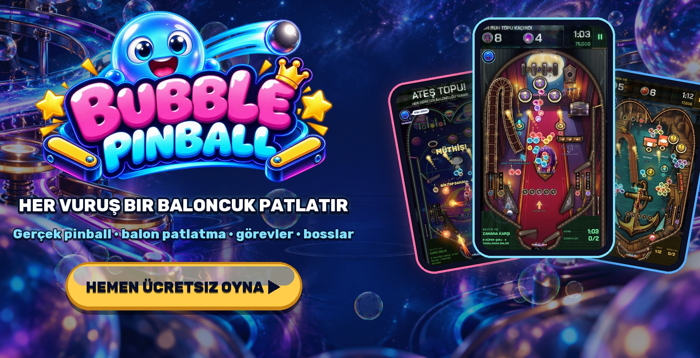
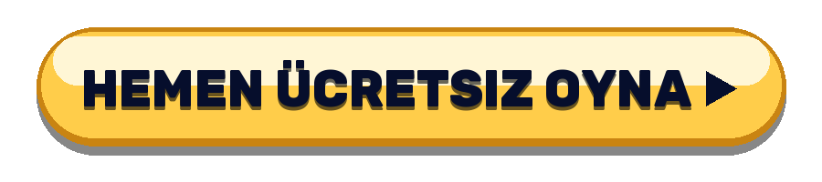
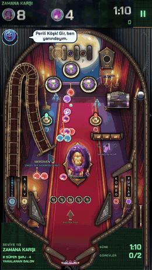
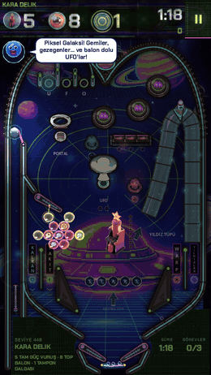
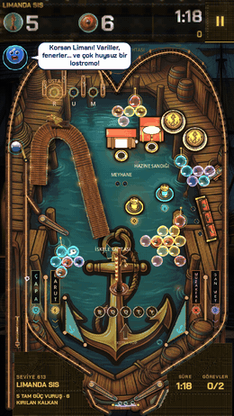
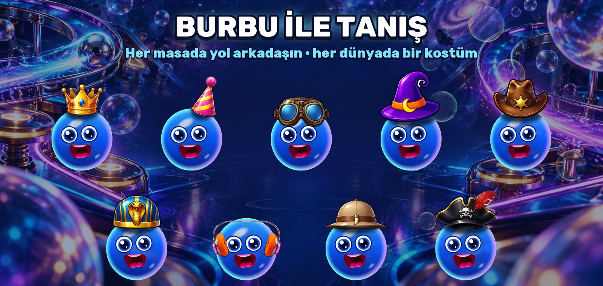
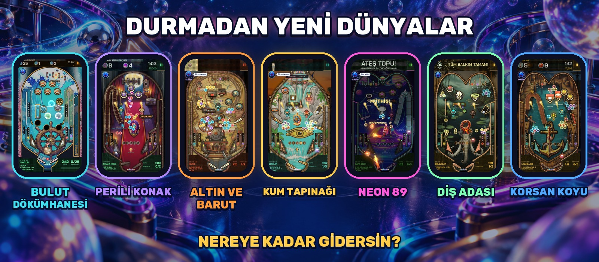

  

  <b>Her vuruşun bir baloncuk patlattığı gerçek bir pinball makinesi.</b> 
  İndirme yok · üyelik yok · telefon, tablet ve PC

  

  <a href="https://bubblepinball.com">bubblepinball.com</a> ·
  <a href="https://www.youtube.com/@BubblePinball">YouTube</a> ·
  <a href="assets/gameplay.mp4">Oynanış videosu</a> ·
  <a href="assets/">Basın kiti</a>

[English](README.md) · [Español](README.es.md) · [Deutsch](README.de.md) · [Français](README.fr.md) · [Italiano](README.it.md) · [Português](README.pt-BR.md) · [Polski](README.pl.md) · [Русский](README.ru.md) · [日本語](README.ja.md) · [한국어](README.ko.md) · [Bahasa Indonesia](README.id.md)

---

<table>
  <tr>
    <td align="center" width="33%"></td>
    <td align="center" width="33%"></td>
    <td align="center" width="33%"></td>
  </tr>
  <tr>
    <td align="center"><h3>Koca salkımları patlat</h3>Topu bir renkle yükle ve masanın üstünde asılı balonları patlat. Bir salkımın çapasını vur, hepsi birden düşsün.</td>
    <td align="center"><h3>Gerçek pinball</h3>Flipperlar, bumperlar, sapanlar, rampalar, spinnerlar, delikler ve çoklu top; hepsi gerçek fizikle. Top yaramazlık yaparsa masayı sarsın.</td>
    <td align="center"><h3>Her masada bir görev</h3>Hapsolmuş balonları kurtar, uçan balonları yakala, taşları kır, saati yen. Hiçbir masa aynı oynanmaz.</td>
  </tr>
</table>

## Neden bırakamıyorsun

- **Her masa yeni bir meydan okuma.** Kendi düzeni, kendi oyuncakları, kendi görevleri ve her atışı bir karara çeviren bir saat.
- **Karşılık veren bosslar.** Dev bosslar bölgeleri koruyor: aşamalar, saldırılar ve son bir direniş.
- **Hep yeni bir şey var.** Kendi makineleri, müzikleri, bossları ve oyuncaklarıyla koca dünyalar geliyor.
- **İhtiyacın olduğunda yardım.** Takıldığında Burbu doğru yardımı yakar: iğne, gökkuşağı topu, mıknatıs ya da ekstra saniyeler.
- **Kısa oturumlar için.** Bir masa birkaç dakika sürer. Bir tane daha? Tabii.

  

## Burbu™ ile tanış

**Burbu™** mavi camdan bir balon ve Bubble Pinball™'daki yol arkadaşın. Seni cesaretlendirir, masa zorlaşınca ipucu verir, her zaferi seninle kutlar ve her dünyada yeni bir kostüm giyer. Birlikte oynadıkça daha iyi arkadaş olursunuz.

  

## Durmadan yeni̇ dünyalar

| Dünya | Bölgeler |
|---|---|
| **BULUT DÖKÜMHANESİ** | BULUT ATÖLYESİ · KÖPÜK DENİZİ · KRİSTAL SERA · FIRTINA DÖKÜMHANESİ · YILDIZ TACI |
| **PERİLİ KONAK** | Giriş Salonu · Kütüphane · Balo Salonu · Saat Kulesi · Mezarlık |
| **ALTIN VE BARUT** | Salon · Maden · Altın Treni · Banka · Kanyon |
| **KUM TAPINAĞI** | Sfenks · Firavunun Mezarı · Nil · Hazine Odası · Ra Tapınağı |
| **NEON 89** | Oyun Salonu · Gece Yolculuğu · Piksel Galaksi · Dans Pisti · Siber Şehir |
| **DİŞ ADASI** | Vahşi Kıyı · Azı Dişi Ormanı · Katran Bataklığı · Yanardağ · Kralın Yuvası |
| **KORSAN KOYU** | Korsan Limanı · Kalyon · Hazine Adası · Batık Resif · Fırtınanın Gözü |
| **…ve dahası** | Yeni dünyalar gelmeye devam ediyor. |

   
  Android ve iOS çok yakında

---

Bubble Pinball™ ve Burbu™, MAVA Games'in ticari markalarıdır. © 2026 MAVA Games. Tüm hakları saklıdır. The names, logos, characters, images, videos and all other content in this repository are the property of MAVA Games; no licence is granted to copy, modify, distribute or use any of it. This repository holds public information about the game and does not contain its source code.
